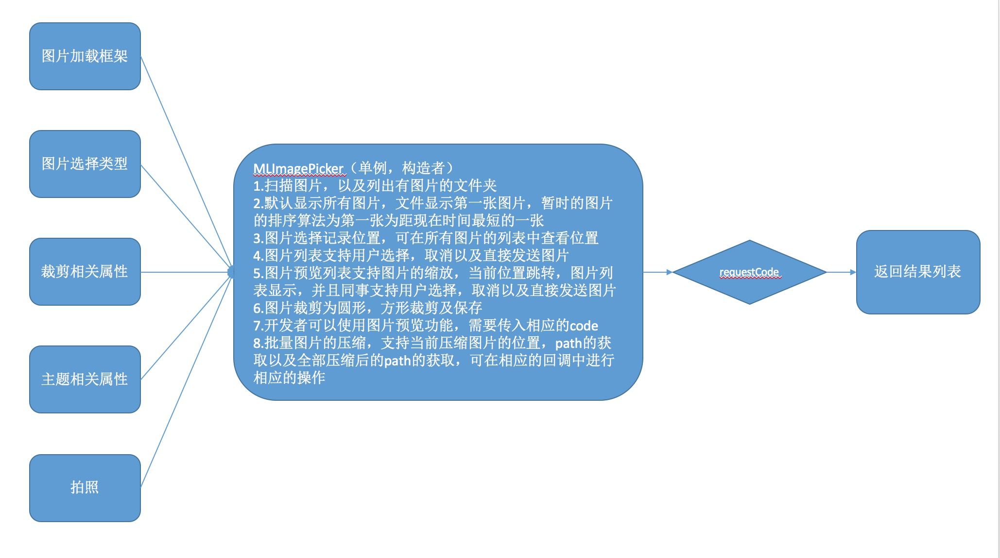
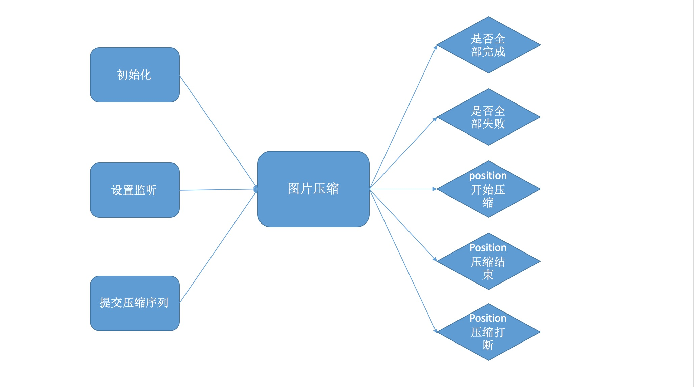

# ImagePickerDemo
图片选择器

### 1.效果预览


### 2.设计思路




### 3.图片选择使用（建议使用kotlin用法，java用法可以看kotlin的内部实现，也可以采用onresult方式）
```
//必须需要初始化的接口实现：IImageLoadFrame
MNImagePicker.getInstance()
            .setImageLoadFrame(MyLoadFrame())

//java用法
//获取选择图片列表结果result
MLImagePicker.getInstance().startPictureChoose(activity, resultCode);

//获取相机拍照图片url结果
ImagePickerUtil().takePicture(this@MNImagePickerActivity, requestCode)

//在onActivityResult中根据不同的resultCode拿到相应结果
    @Override
    protected void onActivityResult(int requestCode, int resultCode, Intent data) {
        super.onActivityResult(requestCode, resultCode, data);
        if (resultCode == RESULT_OK) {
            switch (requestCode) {
                case requestCode:
                tvResult.setText(MNImagePicker.getInstance().getTakeImageFile());//获取拍照后的路径
                    break;
            }
        }
    }
    
    
//kotlin用法
//拍照
photoTake {
        it.absolutePath
    }
//类微信单选
photoPickForSingle {
     Toast.makeText(this, "结果：" + it.toString(), Toast.LENGTH_SHORT).show()
   }
//类微信多选
photoPick {
     Toast.makeText(this, "结果：" + it.size, Toast.LENGTH_LONG).show()
   }
   
//辛巴单类目单张
photoPickForSingle(0, titleBeanList) {
     Toast.makeText(this, it.size.toString(), Toast.LENGTH_SHORT).show()
     } 
     
//辛巴单类目多张
photoPick(beanList) {
     Toast.makeText(this, it.size.toString(), Toast.LENGTH_SHORT).show()
     }  
     
//裁剪图片
 photoCrop("/storage/emulated/0/tencent/MicroMsg/WeiXin/mmexport1543213488790.jpg") {
      Toast.makeText(this, it.absolutePath, Toast.LENGTH_SHORT).show()
      }
```


